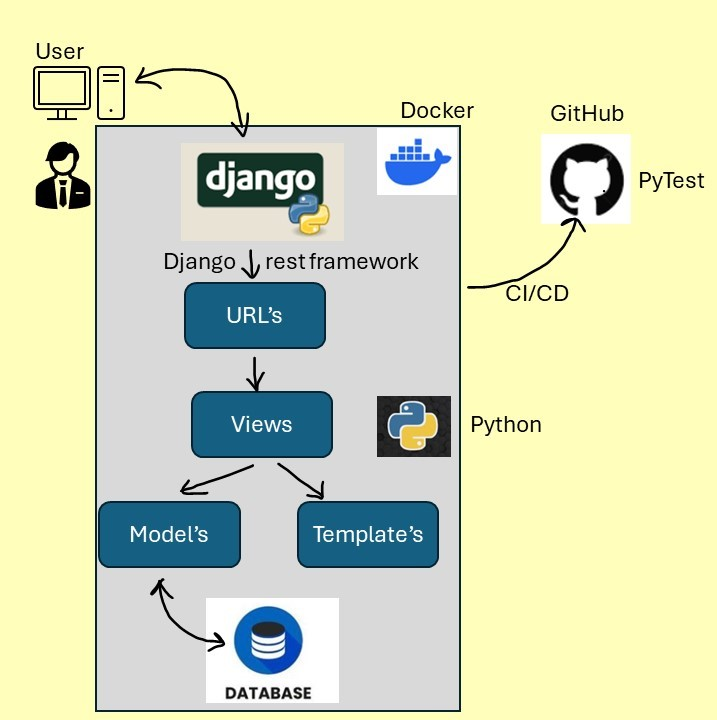

# Twitter Search API (Django project)

A **lightweight and efficient** Twitter Search API built with **Python, Django, and Django REST Framework**. This project utilizes the **Twitter Search API** to fetch, store, filter, and export tweets related to trending events and hashtags.

---

## 🚀 Features

- 🔍 **Search Twitter** - Fetch recent tweets based on trending hashtags or keywords.
- 🗄️ **Store & Retrieve** - Save tweets into a local SQLite database and retrieve them with flexible filtering options.
- 📤 **Export to CSV** - Export tweet data in CSV format for analysis.
- 🖥️ **REST API Endpoints** - Easily interact with tweet data using well-structured API endpoints.

---

## 📌 API Endpoints

### 1️⃣ **Trigger a Twitter Search**
Fetch tweets for high-traffic hashtags.
```bash
GET /search/?query=YourSearchQuery
```
**Example:** `http://127.0.0.1:8000/search/?query=ElectionDay`

### 2️⃣ **Retrieve Stored Tweets**
Fetch tweets stored in the database with optional filtering.
```bash
GET /twitterSearch/
GET /twitterSearch/?search=YourKeyword
```
**Example:** `http://127.0.0.1:8000/twitterSearch/?search=ko`

### 3️⃣ **Export Tweets to CSV**
Export stored tweets to CSV, selecting relevant columns.
```bash
GET /twitterDataExport/
```
**Example:** `http://127.0.0.1:8000/twitterDataExport/`

---

## 📂 Project Structure


---

## 🛠️ Installation

1️⃣ **Clone the Repository**
```bash
git clone https://github.com/yourusername/twitter-search-api.git
cd twitter-search-api
```

2️⃣ **Create & Activate Virtual Environment**
```bash
python -m venv env
source env/bin/activate  # On Windows use `env\Scripts\activate`
```

3️⃣ **Install Dependencies**
```bash
pip install -r requirements.txt
```

4️⃣ **Run Database Migrations**
```bash
python manage.py migrate
```

5️⃣ **Start the Development Server**
```bash
python manage.py runserver
```

---

## ⚙️ Environment Variables

To connect to Twitter API, set up the following environment variables:
```bash
TWITTER_API_KEY=<Your_Twitter_API_Key>
TWITTER_API_SECRET_KEY=<Your_Twitter_API_Secret_Key>
TWITTER_ACCESS_TOKEN=<Your_Twitter_Access_Token>
TWITTER_ACCESS_TOKEN_SECRET=<Your_Twitter_Access_Token_Secret>
```

---

## 🧪 Running Tests
Run the test suite to verify functionality:
```bash
python manage.py test
```

---

## 🤝 Contributions

We welcome contributions! 🎉 To contribute:
- Fork the repository.
- Create a new branch.
- Implement your changes.
- Submit a pull request.

Ensure that your code is well-documented and includes relevant tests.

---
## ⭐️ Call-to-Action

If you find this project helpful, please consider:
- **Starring** the repository to show your support.
- **Forking** to contribute improvements.
- **Following** for updates on future projects.

Your engagement helps boost visibility and encourages further collaboration!

---
## 📝 License

This project is licensed under the **MIT License**.

```
MIT License

Copyright (c) 2025

Permission is hereby granted, free of charge, to any person obtaining a copy
of this software and associated documentation files (the "Software"), to deal
in the Software without restriction, including without limitation the rights
to use, copy, modify, merge, publish, distribute, sublicense, and/or sell
copies of the Software, and to permit persons to whom the Software is
furnished to do so, subject to the following conditions:

The above copyright notice and this permission notice shall be included in all
copies or substantial portions of the Software.

THE SOFTWARE IS PROVIDED "AS IS", WITHOUT WARRANTY OF ANY KIND, EXPRESS OR
IMPLIED, INCLUDING BUT NOT LIMITED TO THE WARRANTIES OF MERCHANTABILITY,
FITNESS FOR A PARTICULAR PURPOSE AND NONINFRINGEMENT. IN NO EVENT SHALL THE
AUTHORS OR COPYRIGHT HOLDERS BE LIABLE FOR ANY CLAIM, DAMAGES OR OTHER
LIABILITY, WHETHER IN AN ACTION OF CONTRACT, TORT OR OTHERWISE, ARISING FROM,
OUT OF OR IN CONNECTION WITH THE SOFTWARE OR THE USE OR OTHER DEALINGS IN THE
SOFTWARE.
```

---

💙 **Happy Coding!** 🚀
